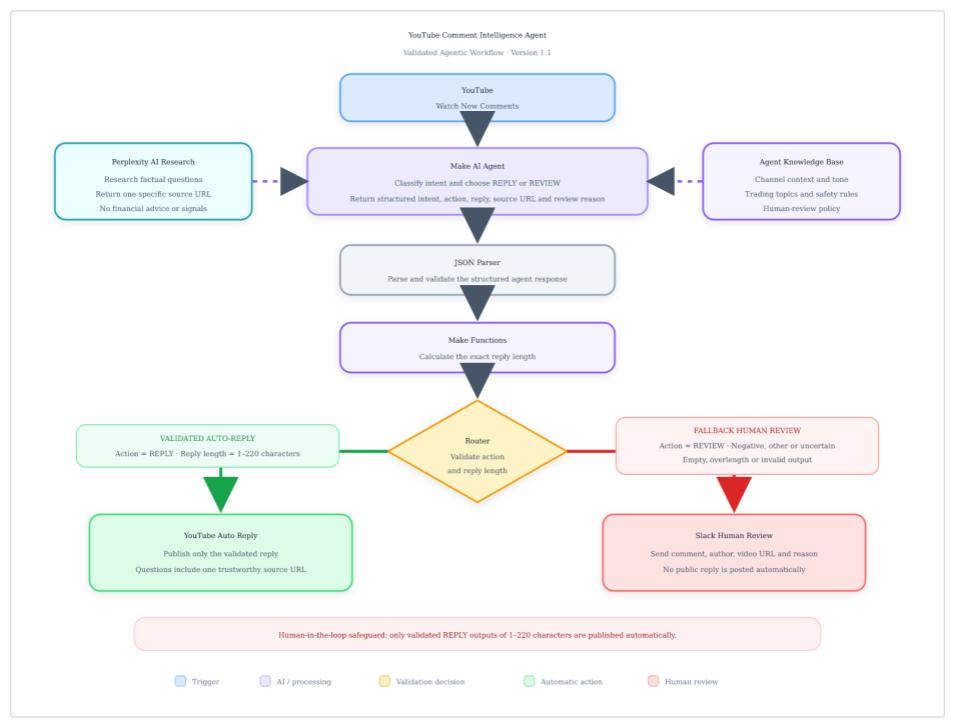
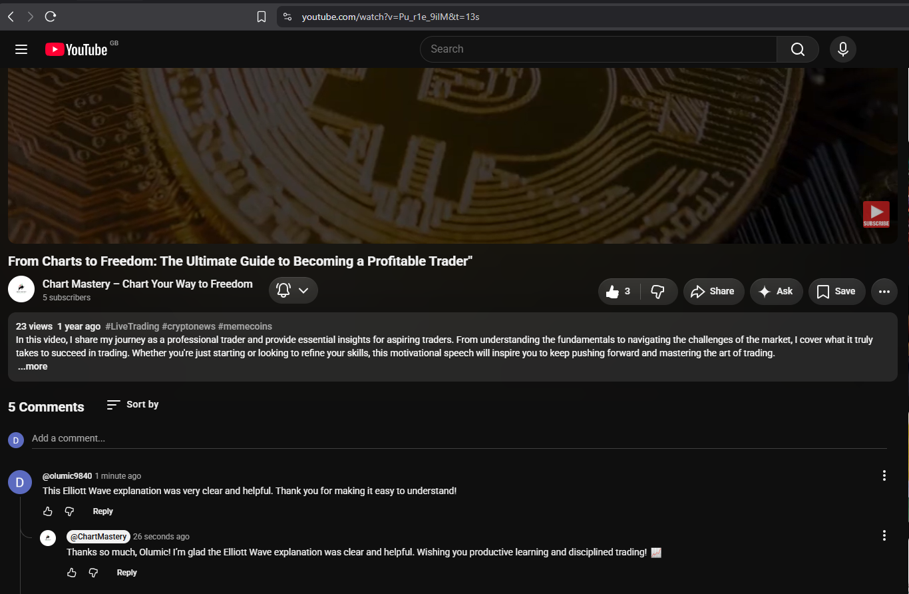
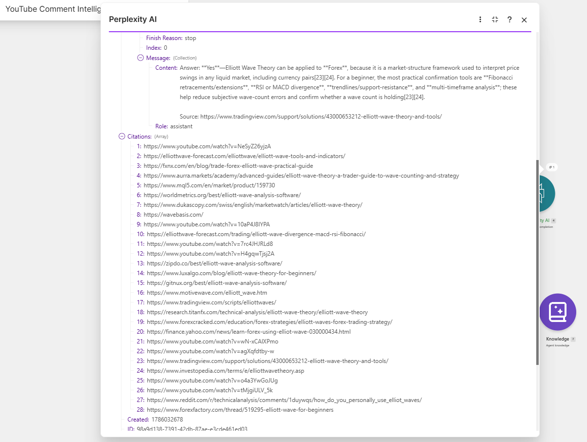
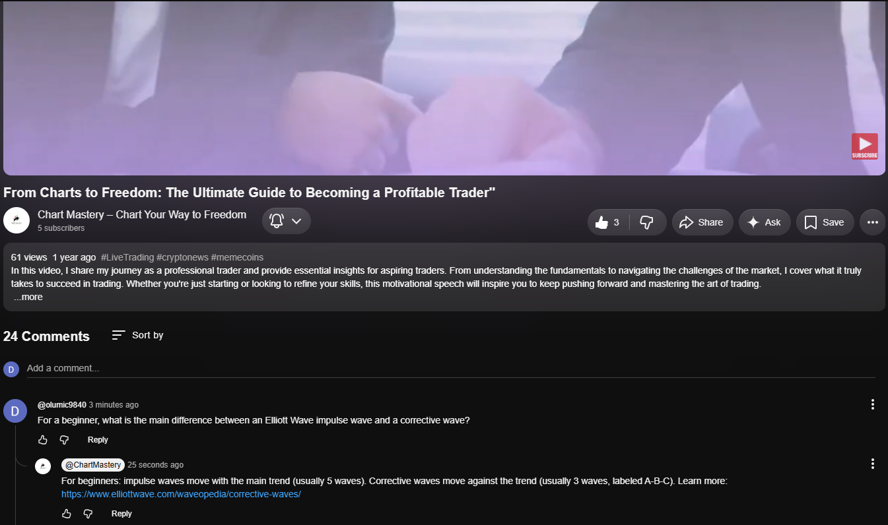
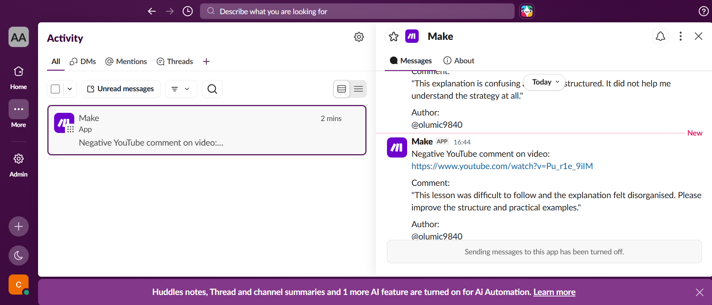
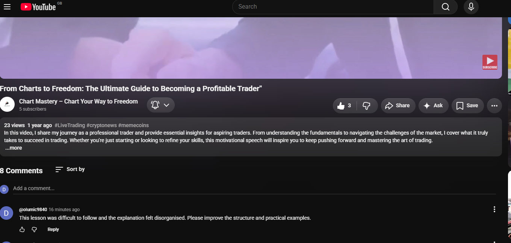

# YouTube Comment Intelligence Agent

> An AI-powered automation system that classifies YouTube comments, researches factual questions, validates AI-generated responses, automatically handles appropriate engagement, and routes sensitive comments for human review.

🎥 **[Watch the 3-Minute Demo](https://youtu.be/UbF9JyB5JPI)**

---

## Project Overview

Managing YouTube comments manually can be slow, inconsistent, and difficult to scale.

Creators need to engage with their audience quickly, but allowing AI to respond automatically to every comment introduces another problem: inappropriate or inaccurate responses can damage audience trust.

I designed and built the **YouTube Comment Intelligence Agent** to demonstrate how AI automation can improve engagement while maintaining appropriate validation and human oversight.

The system combines AI-based intent classification, automated research, structured output, validation, conditional routing, automated replies, and human-in-the-loop review.

---

## Business Problem

A growing YouTube channel may receive different types of comments:

- Positive engagement
- Factual questions
- Negative or sensitive comments
- Other interactions

Treating every comment the same is inefficient and potentially risky.

The challenge was therefore to build an automation that could:

1. Understand the intent of a new comment.
2. Determine the appropriate action.
3. Research factual questions when necessary.
4. Validate AI-generated output before publication.
5. Automatically respond only when appropriate.
6. Escalate sensitive interactions to a human.

---

## Solution

The agent monitors incoming YouTube comments and uses AI to classify each interaction.

Based on the detected intent, the workflow follows a different route.

### Positive Comments

The system generates a concise and relevant response.

The response passes through structured-output validation and character-count checks before being allowed through the automated publishing route.

### Factual Questions

When a viewer asks a factual question, the workflow uses **Perplexity AI** to research the topic and retrieve supporting information.

The system then generates an educational response containing a relevant source and publishes the validated response beneath the viewer's comment.

### Negative or Sensitive Comments

Negative or potentially sensitive comments are **not automatically answered publicly**.

Instead, the system routes the interaction to **Slack for human review**, allowing a person to determine the appropriate response.

This introduces a human-in-the-loop safeguard for higher-risk interactions.

---

## Workflow Architecture

The high-level workflow is:

**YouTube Comment → AI Classification → Structured Output → JSON Validation → Character Validation → Intelligent Router**

The router then determines the appropriate path:

**Positive → Validated Automated Reply**

**Question → Research → Source → Validated Educational Reply**

**Negative / Sensitive → Slack Human Review → No Automatic Public Reply**

---

## Technology Stack

| Technology | Purpose |
|---|---|
| Make | Workflow automation and orchestration |
| AI Agent | Intent classification and response decisioning |
| Perplexity AI | Research and source retrieval |
| YouTube | Comment monitoring and automated replies |
| Slack | Human-review notifications |
| JSON | Structured AI output and validation |
| Make Functions | Response validation and character-count logic |

---

## AI Decision Logic

The agent classifies comments into four primary categories:

- `positive`
- `question`
- `negative`
- `other`

The structured AI response contains the information required by downstream automation, including the intended action, generated reply, source information where appropriate, and review reasoning.

This allows the automation layer to validate the AI output before taking an external action.

---

## Validation & Safety Controls

A core design objective was preventing uncontrolled AI-generated public responses.

The workflow therefore includes several safeguards:

### Structured Output Validation
AI output is parsed and validated before routing.

### Character-Length Validation
Automated responses must remain within the configured response-length limit before publication.

### Conditional Routing
Different comment intents follow different automation paths rather than sharing one universal response process.

### Human-in-the-Loop Review
Negative and sensitive interactions are escalated to Slack instead of being automatically published.

### Source-Based Research
Factual questions can trigger external research before an educational response is generated.

---

## Testing

The system was tested across multiple scenarios.

| Test | Expected Behaviour | Result |
|---|---|---|
| Positive Comment | Generate and publish an appropriate concise response | ✅ Passed |
| Factual Question | Research topic, generate sourced response and publish | ✅ Passed |
| Negative Comment | Escalate to Slack and prevent automatic public reply | ✅ Passed |
| Structured Output | Parse AI response successfully | ✅ Passed |
| Character Validation | Validate response length before publishing | ✅ Passed |

### Test Evidence

#### Positive Comment — Automated Public Reply

The agent classified the positive interaction and successfully generated and published an appropriate automated response.

#### Factual Question — Research & Source Retrieval

The agent identified the comment as a factual question and used Perplexity AI to retrieve supporting information from a specific source.

The validated educational response was then published beneath the viewer's original YouTube comment with the supporting source link.

#### Negative Comment — Human Review Safeguard

The agent identified the higher-risk interaction and routed it to Slack for human review instead of automatically responding publicly.

The negative test also confirmed that no automatic public reply was published.

---

## Example Research Test

A viewer submitted a factual question relating to **Elliott Wave**.

The agent identified the comment as a question, triggered research, retrieved supporting information, generated an educational response with a source, and published the response beneath the original YouTube comment.

This demonstrated that the system could move beyond simple predefined replies and perform research-driven response automation.

---

## Human-in-the-Loop Safeguard

One of the most important design decisions was deliberately limiting full automation.

For higher-risk interactions, the objective is not:

> AI decides → AI immediately publishes.

Instead, the architecture supports:

> AI identifies risk → automation escalates → human reviews → human decides.

This approach allows automation to improve speed and efficiency without removing human judgement from sensitive public interactions.

---

## Key Capabilities Demonstrated

- AI intent classification
- AI agent workflow design
- Workflow orchestration
- Structured AI output
- JSON parsing and validation
- Conditional routing
- Automated research
- Source-aware response generation
- Application integration
- Human-in-the-loop automation
- Error handling
- Workflow testing
- Business-process automation design

---

## Demo

🎥 **Watch the complete project demonstration:**

**[YouTube Comment Intelligence Agent — 3-Minute Demo](https://youtu.be/UbF9JyB5JPI)**

The demonstration shows the workflow architecture, live Make scenario, validation logic, research process, successful automated responses, and human-review safeguard.

---

## Design Philosophy

The objective of this project was not simply to automate YouTube replies.

It was to demonstrate a broader principle:

**Automate high-confidence actions while preserving human oversight for higher-risk decisions.**

This pattern can be applied to customer support, social-media management, lead qualification, community management, internal operations, and other AI-assisted business workflows.

---

## Project Status

**Status:** Completed — Portfolio Project

**Version:** 1.0

---

## Author

**Michael Oluwaleye**

AI Automation Specialist

Focused on AI agents, workflow automation, business-process automation, and practical AI integrations.

---

## Security Notice

No API keys, authentication credentials, access tokens, private webhook URLs, or sensitive account information are included in this repository.
